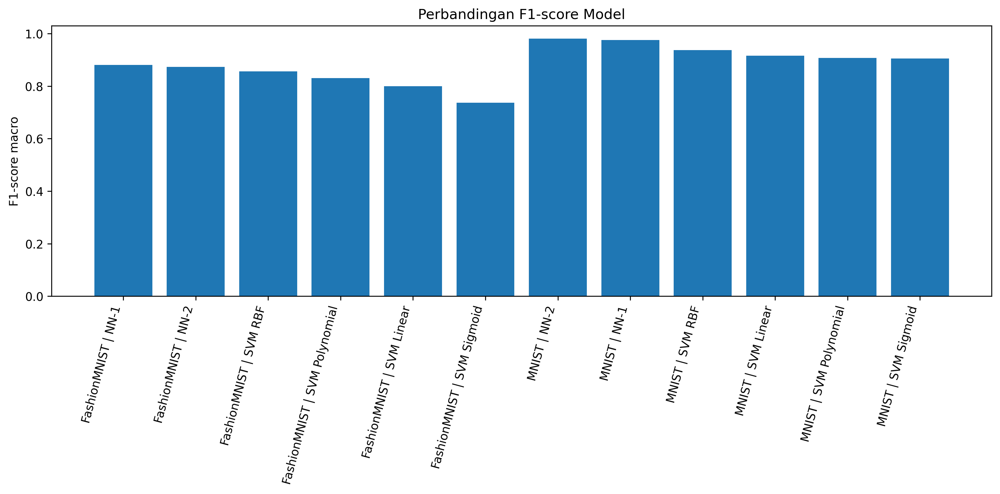
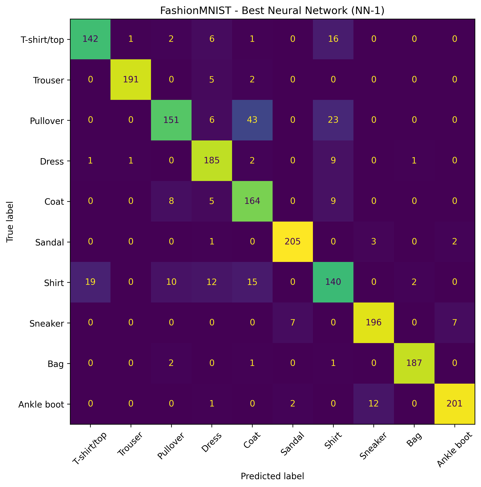
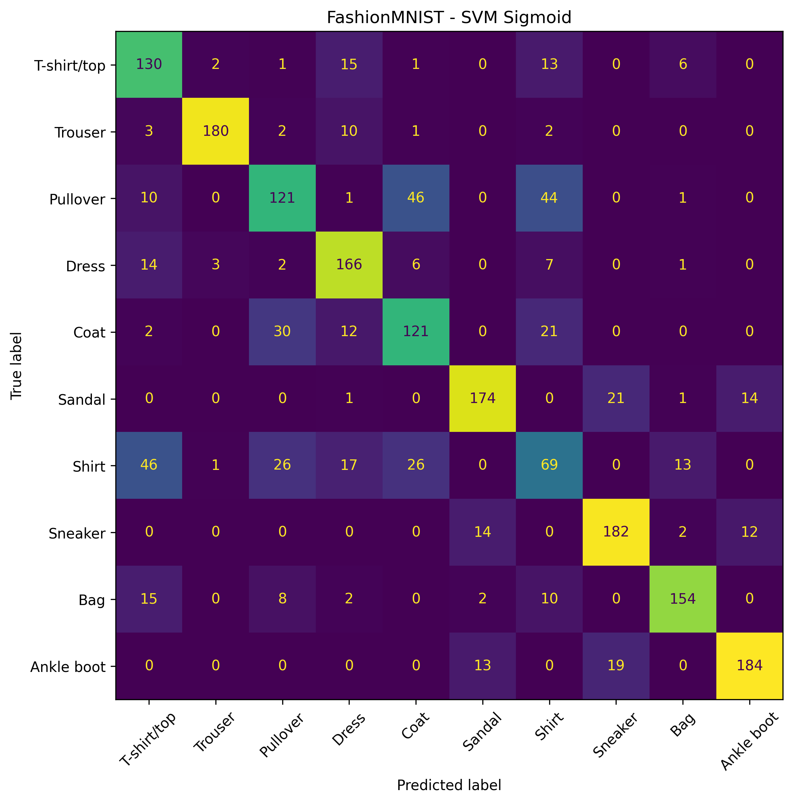
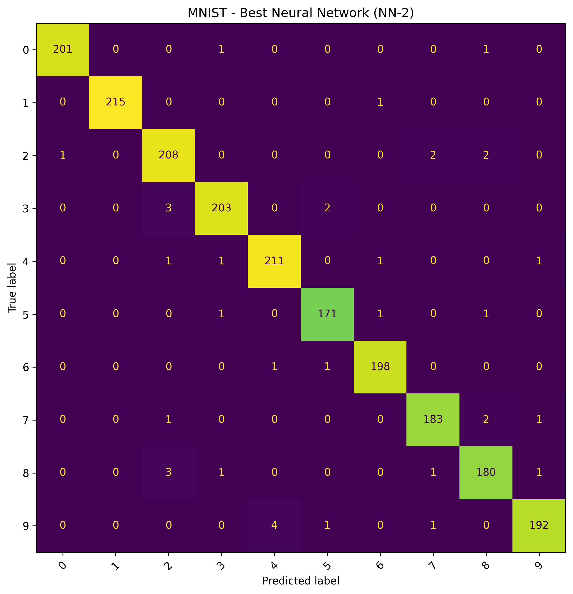
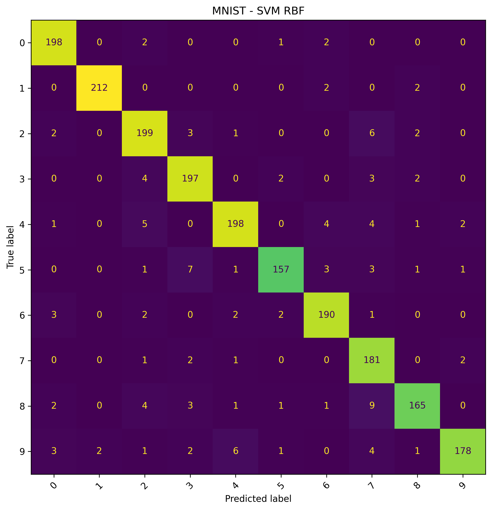
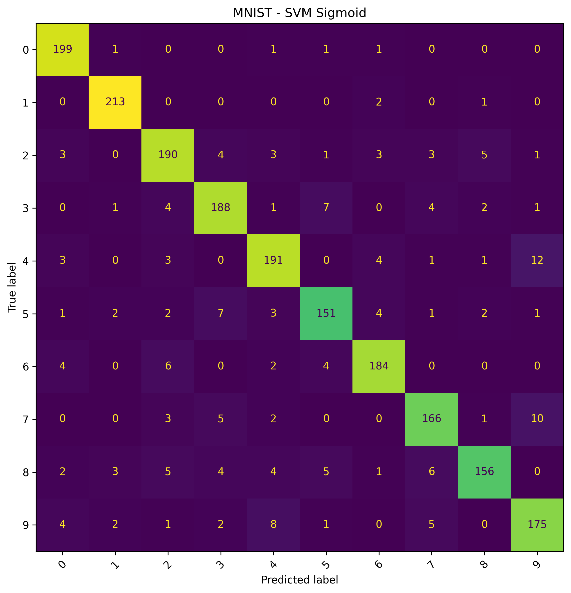

<div align="center">

# 🧠 Neural Network vs Support Vector Machine

### Comparative Analysis on MNIST & FashionMNIST

<p align="center">
Machine Learning Comparative Study using PyTorch and Scikit-learn
</p>


</div>

---

# 📌 Project Overview

This project was developed as part of the **Data Mining** course assignment to compare the performance of **Neural Network** and **Support Vector Machine (SVM)** models on image classification tasks using the **MNIST** and **FashionMNIST** datasets.

The implementation focuses on evaluating classification performance using several machine learning evaluation metrics and analyzing the strengths and weaknesses of each model architecture and kernel configuration.

The project utilizes:

- PyTorch with CUDA acceleration
- Scikit-learn SVM
- Jupyter Notebook modular workflow
- Matplotlib visualization
- Confusion Matrix analysis

---

# 🗂️ Dataset

## MNIST

- Handwritten digit dataset
- 10 classes (0–9)
- Grayscale images (28×28)

## FashionMNIST

- Fashion image dataset
- 10 clothing categories
- Grayscale images (28×28)

---

# 🧠 Models Used

## Neural Network

| Model | Architecture                        |
| ----- | ----------------------------------- |
| NN-1  | 784 → 128 → 10                      |
| NN-2  | 784 → 256 → Dropout(0.3) → 128 → 10 |

### Configuration

- Activation Function: ReLU
- Optimizer: Adam
- Loss Function: CrossEntropyLoss
- Framework: PyTorch CUDA

---

## Support Vector Machine (SVM)

The following kernels were evaluated:

- Linear
- Polynomial
- RBF
- Sigmoid

### Configuration

- StandardScaler normalization
- Scikit-learn SVC implementation

---

# 📏 Evaluation Metrics

The models were evaluated using:

- Accuracy
- Precision
- Recall
- F1-score
- Confusion Matrix

---

# 🏆 Best Results

| Dataset      | Best Model            | F1-score |
| ------------ | --------------------- | -------- |
| MNIST        | Neural Network (NN-2) | 0.9808   |
| FashionMNIST | Neural Network (NN-1) | 0.8802   |

> Best SVM Kernel: **RBF Kernel**

---

# 📊 Model Comparison

## F1-score Comparison



---

# 🔍 Confusion Matrix Analysis

## FashionMNIST - Best Neural Network (NN-1)



---

## FashionMNIST - Worst SVM Performance (Sigmoid)



---

## MNIST - Best Neural Network (NN-2)



---

## MNIST - Best SVM Kernel (RBF)



---

## MNIST - Worst SVM Performance (Sigmoid)



---

# 📈 Analysis Summary

From the experimental results:

- Neural Network achieved the highest overall performance on both datasets.
- The NN-2 architecture produced the best performance on MNIST with an F1-score of 0.9808.
- The NN-1 architecture achieved the best result on FashionMNIST with an F1-score of 0.8802.
- Among SVM kernels, RBF consistently outperformed Linear, Polynomial, and Sigmoid kernels.
- Sigmoid kernel produced the weakest classification performance, especially on FashionMNIST.
- FashionMNIST classification is more challenging due to visual similarity among clothing categories.

---

# ⚙️ Technical Details

<details>
<summary>Neural Network Training Details</summary>

### Hyperparameters

- Epochs: 10
- Batch Size: 64
- Learning Rate: 0.001

### Framework

- PyTorch
- CUDA 12.6
- GPU Acceleration Enabled

</details>

<details>
<summary>SVM Kernel Details</summary>

### Kernels Used

- Linear
- Polynomial (degree=3)
- RBF
- Sigmoid

### Preprocessing

- StandardScaler normalization
- Flattened image vector (784 features)

</details>

<details>
<summary>Hardware Specification</summary>

### System

- AMD Ryzen 7 6800H
- NVIDIA GeForce RTX 3050 Laptop GPU
- 16 GB RAM

</details>

---

# 📁 Project Structure

```bash
UTS_Data_Mining/
│
├── models/
│
├── notebooks/
│   ├── 1_data_preparation.ipynb
│   ├── 2_neural_network_training.ipynb
│   ├── 3_svm_training.ipynb
│   └── 4_evaluation_visualization.ipynb
│
├── results/
│   ├── comparison_chart.png
│   ├── nn_results.csv
│   ├── svm_results.csv
│   └── confusion_matrix/
│
├── README.md
├── requirements.txt
└── .gitignore
```
